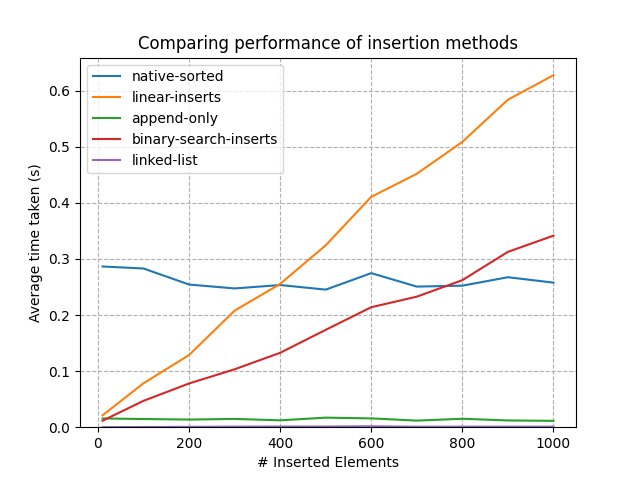
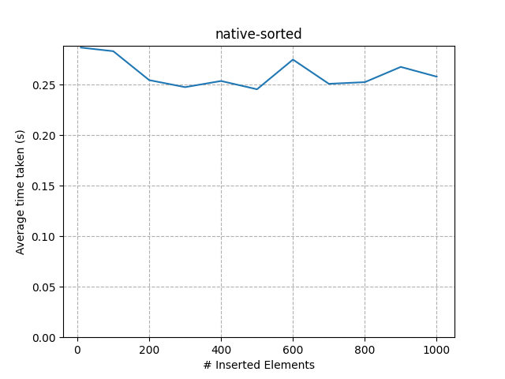
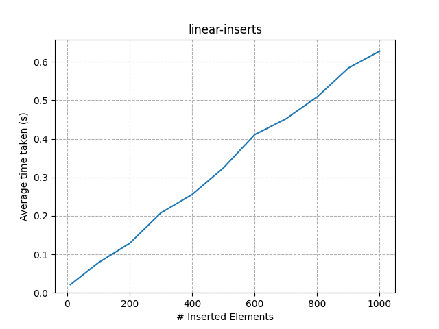
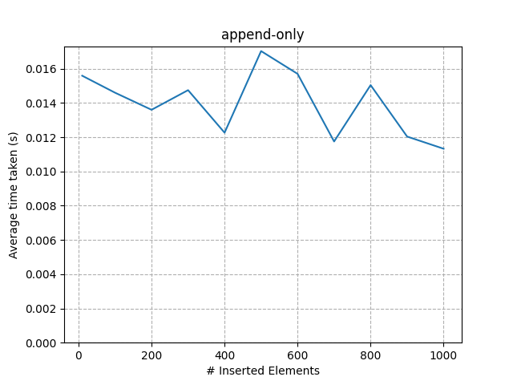
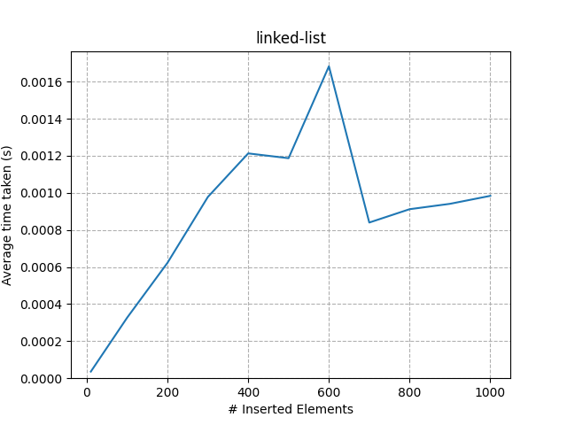
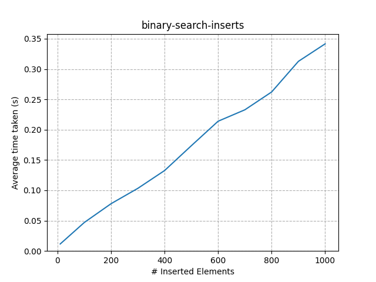
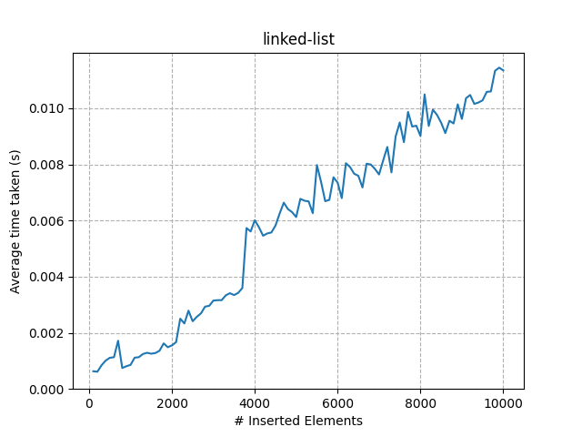

# The performance of different array insertion techniques

This repo contains various approaches for inserting new random elements into an already-sorted array. The existing array is orders of magnitude greater than the array we are merging into it.

## Methods:

The various approaches taken are outlined below:

### Native

This method appends the new elements onto the end of the existing array and uses Python's native `sorted` method to re-sort the entire array. This is the easiest approach to code but probably isn't the most performant.

### Linear inserts

This method linearly steps along both arrays and inserts the values from the new array into the sorted array at the appropriate location.

### Append-only

This method instantiates a new array and steps linearly along both arrays. It appends the current value from whichever array is necessary to maintain ordering.

### Linked-List

This method uses a linked-list data-structure. The linked-list is traversed and at the location where an insertion is required, it creates a new node with the insertion value and maps the previous node's `next` to the new node, and the new node's `next` to the previous node's original `next`.

### Binary-search inserts

Given that the original array is sorted, we can traverse it using binary search to find the insertion location much more quickly. When the insertion location is found, the element is inserted into the array.

## Results

To test each approach, an initial array of 1,000,000 random values between 0-1 were created and sorted. A new array of different sizes (10 - 1,000) of random values was provided and inserted into the original array in a manner to maintain the sorted ordering, using each of the techniques outlined above.

The results are shown below:

### Native

This approach performs well across all sizes of new arrays. It demonstrates constant-time, which was unexpected. However, after doing some research, it seems that the native `sorted` method is optimised for exactly this kind of scenario, which explains why it works in **O(1)** time.

The chart shows however that re-sorting the entire array is generally slow, across all lengths. It takes as long to insert 10 new elements as it does to insert 1,000 new elements.

### Linear inserts

The `linear-inserts` results show clearly that the algorithm has time-complexity of **O(n)**. This is expected because on every insert, Python must go and re-index every subsequent value. The true time-complexity is probably **O(m + n)**, where time is proportional to both the length of the original array and the number of elements being inserted.

### Append-only

The algorithm that creates a new list and appends the appropriate value from each input surprisingly demonstrates constant time across the ranges tested. This was unexpected (I expected **O(n)** at least), but it indicates that appending to the end of an array is a **much faster** operation than inserting in the middle, as no re-indexing of latter elements is required.

### Linked-List

The results of the `linked-list` approach are hard to see on the original chart as they are so close to the x-axis, indicating that the time taken is an order of magnitude lower than the other techniques. We need to look at the individual chart to actually see the time-complexity.

The individual chart is a little noisy but it shows a generally increasing trend with the number of insertions made i.e. **O(n)**. However, it appears that each insert is so quick that the timing results could actualy be affected by other processes running on my machine while performing this test.

### Binary-search inserts

As would be expected, the `binary-search-inserts` algorithm performs better than the `linear-inserts` algorithm because it can find the insertion location much more quickly. However, it cannot escape the fact that inserting into an array is a fundamentally **O(n)** operation, so while faster than `linear-inserts` and other methods for **small** sizes of new arrays, it becomes slower when the size of the new array grows.

# Conclusion

The linked-list approach is an order of magnitude faster than the other solutions, so it would be recommended for applications where performance is paramount. However, the reality is that the data in a linked-list is less accessible for other processing, and converting back and forth to other formats (e.g. lists) might undo the performance benefits.

The algorithm that provides the best compromise of simplicity and performance (in my opinion) is the `append-only` algorithm. I did not expect it to perform so well but it makes sense that `.append()` operations are significantly more performant than any kind of `.insert()` operations.

# BONUS

Given the performance of the `linked-list` solution, an extended run was performed which shows that it does indeed work in **O(n)** time. However, there is fairly significant noise in the results, which again implies that other processes running on my machine while the test is being performed may be influencing the results.

